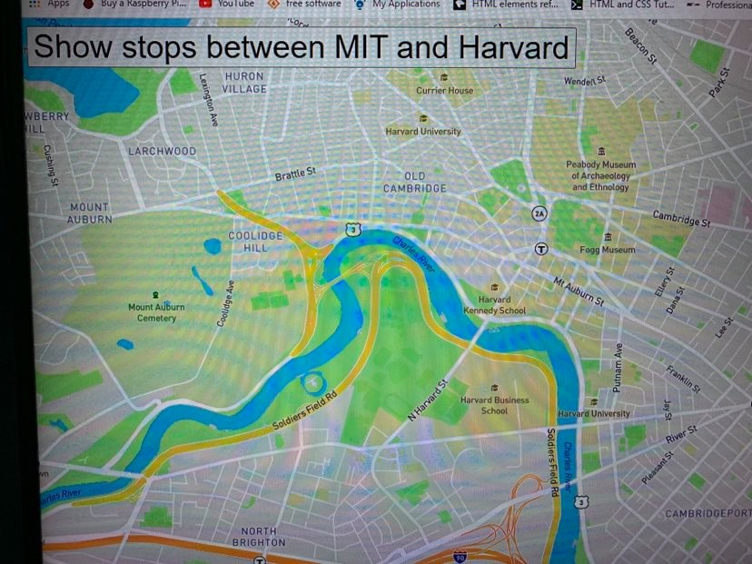

# Real-Time-Bus-Tracker
Showing how many bus stop locations from MIT to HARVARD

**Project Title:** Real-Time-Bus-Tracker

 

 
<a href="https://keoyoulong.github.io/">Link To Home Page</a>
 

When clicking the Button <Show Stops Between MIT and HARVARD>, the map location of bus stops would be shown on the map.
  
To Run the project, have to download or close all files in the repository to your local machine in the same directory. Then run the index.html file on your broswer. 
Finally click the the button metioned above.
  
For future improvement, i would give the detail of each bus stops like giving more detail on what bus number and time.  
License Information: should refer to MIT license file.
